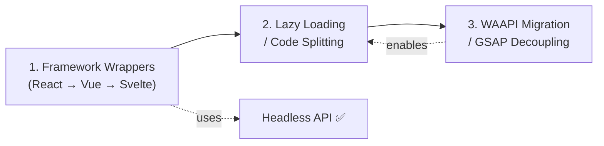

# NEXT_STEPS.md — Remaining Development Roadmap

> **Status:** Headless Mode ✅ and Focus Management ✅ are complete.
> The three remaining items from PLAN.md are: Framework Wrappers, Lazy Loading, and WAAPI Migration.

---

## Dependency Graph



**Critical path:** Wrappers → Lazy Loading → WAAPI Migration. Each step depends on the previous.

---

## Step 1: Framework Wrappers

### Overview
Create first-party packages (`@tiktik/react`, `@tiktik/vue`, `@tiktik/svelte`) that wrap the vanilla core. Each wrapper uses the existing headless `render` callback internally, so the vanilla engine handles all lifecycle, timers, swipe, stacking, and animations.

### 1.1 Monorepo Setup
**Effort:** 1–2 days

| Task | Detail |
|---|---|
| Convert to monorepo | Use npm workspaces (or pnpm). Root `package.json` with `"workspaces": ["packages/*"]` |
| Move vanilla core | `packages/tiktik/` — the current `src/` moves here unchanged |
| Create wrapper dirs | `packages/react/`, `packages/vue/`, `packages/svelte/` |
| Shared build | Root `turbo.json` or `npm run build` script that builds core first, then wrappers |
| Shared tsconfig | `tsconfig.base.json` at root, extended by each package |

**New directory structure:**
```
tiktik/
├── packages/
│   ├── tiktik/           ← vanilla core (current src/)
│   │   ├── src/
│   │   ├── package.json  ← name: "tiktik"
│   │   └── rollup.config.mjs
│   ├── react/
│   │   ├── src/
│   │   ├── package.json  ← name: "@tiktik/react"
│   │   └── tsconfig.json
│   ├── vue/
│   │   └── ...
│   └── svelte/
│       └── ...
├── package.json          ← workspaces root
├── tsconfig.base.json
└── index.html            ← demo stays at root
```

### 1.2 React Wrapper (`@tiktik/react`)
**Effort:** 3–5 days

#### API Design
```tsx
// Provider — wraps app, initializes config
<TiktikProvider config={{ theme: 'dark', stackStyle: 'deck' }}>
  <App />
</TiktikProvider>

// Hook — returns toast methods
const { success, error, promise, dismiss } = useTiktik();
success('Saved!');

// Headless hook — custom JSX rendering
const { showToast } = useTiktik();
showToast({
  message: 'Custom',
  render: (opts, dismiss) => {
    const el = document.createElement('div');
    // React will portal into this element
    return el;
  }
});

// Component — declarative toast
<TiktikToast type="success" message="Done!" visible={showToast} />
```

#### Files to Create
| File | Purpose |
|---|---|
| `src/TiktikProvider.tsx` | React context provider, calls `Tiktik.configure()` on mount |
| `src/useTiktik.ts` | Hook returning `{ success, error, info, warning, loading, promise, dismiss, dismissAll, showToast }` |
| `src/TiktikToast.tsx` | Optional declarative component (uses imperative API under the hood) |
| `src/index.ts` | Named exports for all public APIs |

#### Dependencies
```json
{
  "peerDependencies": {
    "react": ">=17.0.0",
    "react-dom": ">=17.0.0",
    "tiktik": "^2.0.0"
  }
}
```

#### Build
- Rollup with `@rollup/plugin-typescript` and `external: ['react', 'react-dom', 'tiktik']`
- Output: ESM + CJS

### 1.3 Vue Wrapper (`@tiktik/vue`)
**Effort:** 3–5 days

#### API Design
```vue
<!-- Plugin install -->
<script>
import { createApp } from 'vue';
import { TiktikPlugin } from '@tiktik/vue';
const app = createApp(App);
app.use(TiktikPlugin, { theme: 'dark' });
</script>

<!-- Composable -->
<script setup>
import { useTiktik } from '@tiktik/vue';
const { success, promise } = useTiktik();
success('Saved!');
</script>
```

#### Files to Create
| File | Purpose |
|---|---|
| `src/plugin.ts` | Vue 3 plugin, calls `Tiktik.configure()` |
| `src/useTiktik.ts` | Composable returning toast methods |
| `src/index.ts` | Named exports |

#### Dependencies
```json
{
  "peerDependencies": {
    "vue": ">=3.3.0",
    "tiktik": "^2.0.0"
  }
}
```

### 1.4 Svelte Wrapper (`@tiktik/svelte`)
**Effort:** 2–3 days

#### API Design
```svelte
<script>
  import { tiktik } from '@tiktik/svelte';
  tiktik.success('Saved!');
</script>

<!-- Or use the action -->
<button use:toast={{ message: 'Clicked!', type: 'success' }}>
  Click me
</button>
```

#### Files to Create
| File | Purpose |
|---|---|
| `src/tiktik.ts` | Pre-configured instance export |
| `src/action.ts` | Svelte `use:` action for declarative usage |
| `src/TiktikToast.svelte` | Optional component |
| `src/index.ts` | Barrel exports |

### 1.5 Demo Pages
**Effort:** 2 days (across all 3 frameworks)

- Create `demo/react/`, `demo/vue/`, `demo/svelte/` directories
- Each with a minimal Vite app showcasing hooks, provider, and headless render
- Link from main `index.html`

### Total Effort for Step 1: ~2–3 weeks

---

## Step 2: Lazy Loading / Code Splitting

### Overview
Break the monolithic bundle into a lightweight core (~3KB) and dynamically-imported feature modules. The core handles basic toast show/dismiss; heavy features load on demand.

### Prerequisites
- Step 1 (framework wrappers) should be done first so lazy loading benefits all packages
- WAAPI migration (Step 3) is NOT required, but would amplify the bundle savings

### 2.1 Identify Splittable Modules

| Module | Current Size | Used By | Can Lazy-Load? |
|---|---|---|---|
| `animations.ts` | 7.6KB | Every toast | ❌ Core (but GSAP path can be lazy) |
| `swipe.ts` | 5.1KB | Swipeable toasts | ✅ Only when `swipeToDismiss: true` |
| `focus.ts` | 3.7KB | First toast show | ✅ Lazy on first show |
| `icons.ts` | 2.6KB | Every toast | ❌ Core |
| `dom.ts` | 6.4KB | Every toast | ❌ Core |
| `config.ts` | 1.3KB | Everywhere | ❌ Core |
| `toast-manager.ts` | 8.6KB | Everywhere | ❌ Core |
| `types.ts` | 3.3KB | Everywhere | ❌ Types (compile-time only) |
| `tiktik.css` | 13.5KB | Everywhere | ❌ Core (but can extract themes) |

### 2.2 Implementation Plan
**Effort:** 1 week

#### a) Dynamic Import for Swipe Module
```typescript
// In toast-manager.ts — currently:
import { attachSwipe } from './swipe';

// After:
async function getSwipe() {
  const { attachSwipe } = await import('./swipe');
  return attachSwipe;
}
```

#### b) Dynamic Import for Focus Module
```typescript
// In toast-manager.ts — currently:
import { registerFocusShortcut, autoFocusIfActionable } from './focus';

// After:
let focusLoaded = false;
async function ensureFocus() {
  if (focusLoaded) return;
  const { registerFocusShortcut, autoFocusIfActionable } = await import('./focus');
  registerFocusShortcut();
  focusLoaded = true;
  return autoFocusIfActionable;
}
```

#### c) Extract Promise Logic
The promise handling in `index.ts` can be split into a separate `promise.ts` module:
```typescript
// In src/promise.ts (new file)
export async function promiseToast<T>(
  promiseValue: Promise<T>,
  options: PromiseOptions<T>,
  toastOptions?: Partial<ToastOptions>
): Promise<T> { ... }

// In index.ts:
async promise<T>(...args) {
  const { promiseToast } = await import('./promise');
  return promiseToast(...args);
}
```

#### d) Rollup Config for Code Splitting
```javascript
// rollup.config.mjs changes:
export default {
  input: 'src/index.ts',
  output: [
    {
      dir: 'dist',        // dir instead of file
      format: 'es',
      sourcemap: true,
      chunkFileNames: 'chunks/[name]-[hash].js',
    },
  ],
  // ... plugins
};
```

#### e) CSS Theme Splitting (optional)
Extract dark/light themes into separate CSS files:
```
dist/
├── tiktik.core.css     (~6KB — structure + animations)
├── tiktik.dark.css     (~3KB — dark theme vars)
├── tiktik.light.css    (~3KB — light theme vars)
```

### 2.3 Expected Bundle Size Impact

| Component | Before | After (estimated) |
|---|---|---|
| Core (index + dom + config + icons + animations) | ~18KB | ~10KB |
| Swipe chunk | — | ~2KB (loaded on demand) |
| Focus chunk | — | ~1.5KB (loaded on demand) |
| Promise chunk | — | ~1KB (loaded on demand) |
| CSS core | ~13.5KB | ~6KB + theme files |

### Total Effort for Step 2: ~1 week

---

## Step 3: WAAPI Migration / GSAP Decoupling

### Overview
Replace GSAP with native Web Animations API (WAAPI) as the primary animation engine. GSAP becomes an optional enhancement, not a peer dependency. The CSS fallback remains as the last resort.

### Prerequisites
- Step 2 (lazy loading) should be done first so the GSAP path can be a lazy-loaded chunk
- Extensive visual regression testing required

### 3.1 Animation Priority Chain
After migration, the animation resolution order becomes:
```
WAAPI (native, zero-dep) → GSAP (opt-in, premium physics) → CSS (fallback)
```

### 3.2 WAAPI Elastic Easing Research
**Effort:** 3–5 days R&D

GSAP's `elastic.out(1, 0.5)` is the signature Tiktik entrance curve. WAAPI doesn't support custom easing functions beyond `cubic-bezier()`, `steps()`, and the `linear()` function (Chrome 113+).

**Approach: Multi-keyframe approximation**
```typescript
// Approximate elastic.out(1, 0.5) with 10 keyframes:
const elasticOut = [
  { offset: 0.00, transform: 'scale(0.3)', opacity: 0 },
  { offset: 0.10, transform: 'scale(1.05)', opacity: 0.7 },
  { offset: 0.20, transform: 'scale(0.97)', opacity: 0.9 },
  { offset: 0.35, transform: 'scale(1.02)', opacity: 1 },
  { offset: 0.50, transform: 'scale(0.99)', opacity: 1 },
  { offset: 0.65, transform: 'scale(1.005)', opacity: 1 },
  { offset: 0.80, transform: 'scale(0.998)', opacity: 1 },
  { offset: 1.00, transform: 'scale(1)', opacity: 1 },
];

// Usage:
el.animate(elasticOut, { duration: 600, fill: 'forwards' });
```

**Key WAAPI animations to implement:**
| Animation | GSAP Original | WAAPI Target |
|---|---|---|
| `animateIn()` | `elastic.out(1, 0.5)` | Multi-keyframe elastic approximation |
| `animateOut()` | `power2.in` | `cubic-bezier(0.55, 0.085, 0.68, 0.53)` |
| `animateProgress()` | `linear` tween | Native `linear` timing |
| `applyDeckLayout()` | `power2.out` transitions | `cubic-bezier(0.25, 0.46, 0.45, 0.94)` |
| `animateContentChange()` | `back.out(1.7)` | `cubic-bezier(0.34, 1.56, 0.64, 1)` |
| `animateSpringBack()` (swipe) | `elastic.out(1, 0.4)` | Multi-keyframe elastic |
| `animateSwipeOut()` | `power2.in` | Same as animateOut |

### 3.3 Implementation Plan
**Effort:** 2–3 weeks

#### a) New `waapi.ts` Module
```
src/
├── animations.ts       ← orchestrator: picks WAAPI/GSAP/CSS
├── waapi.ts            ← [NEW] WAAPI keyframes + animate() calls
├── gsap-adapter.ts     ← [NEW] GSAP-specific tween logic (extracted from animations.ts)
└── ...
```

#### b) Refactor `animations.ts` Resolution
```typescript
// Current:
const gsap = detectGSAP();
if (gsap) { /* GSAP path */ }
else { /* CSS fallback */ }

// After:
if (hasWAAPI() && !prefersReducedMotion()) { /* WAAPI path */ }
else if (hasGSAP()) { /* GSAP premium path (lazy-loaded) */ }
else { /* CSS fallback */ }
```

#### c) WAAPI Feature Detection
```typescript
export function hasWAAPI(): boolean {
  return typeof Element !== 'undefined' &&
    typeof Element.prototype.animate === 'function';
}
```

#### d) Update `package.json`
```diff
- "peerDependencies": {
-   "gsap": "^3.12.0"
- },
+ "optionalDependencies": {},
+ "peerDependencies": {
+   "gsap": "^3.12.0"
+ },
  "peerDependenciesMeta": {
    "gsap": {
      "optional": true
    }
  },
```

#### e) GSAP as Lazy-Loaded Enhancement
```typescript
// Only loaded when user explicitly has GSAP installed:
async function loadGSAPAdapter() {
  const { gsapAnimateIn, gsapAnimateOut, ... } = await import('./gsap-adapter');
  return { gsapAnimateIn, gsapAnimateOut };
}
```

### 3.4 Visual Regression Testing
**Effort:** 3–5 days (parallel with implementation)

| Test | Method |
|---|---|
| Elastic entrance curve | Side-by-side GSAP vs WAAPI frame comparison |
| Spring-back on aborted swipe | Manual touch testing on mobile |
| Deck stacking transitions | Screenshot diff at each keyframe |
| Progress bar smoothness | 60fps check via DevTools Performance panel |
| Reduced-motion fallback | Toggle OS setting, verify instant fade |

### 3.5 Expected Impact

| Metric | Before | After |
|---|---|---|
| GSAP dependency | Required (optional) | Truly optional (enhanced mode) |
| Animation engine | GSAP → CSS | WAAPI → GSAP → CSS |
| Core bundle (no GSAP) | ~18KB + basic CSS anims | ~12KB + full elastic anims |
| Browser support | All (GSAP handles it) | Chrome 84+, Firefox 75+, Safari 13.1+ |

### Total Effort for Step 3: ~2–3 weeks

---

## Recommended Implementation Order

| Phase | Work | Estimated Effort | Dependencies |
|---|---|---|---|
| **A** | Monorepo setup | 1–2 days | None |
| **B** | React wrapper | 3–5 days | Phase A |
| **C** | Vue wrapper | 3–5 days | Phase A |
| **D** | Svelte wrapper | 2–3 days | Phase A |
| **E** | Wrapper demo pages | 2 days | Phases B–D |
| **F** | Lazy loading / code splitting | 1 week | Phases A–E (optional) |
| **G** | WAAPI R&D (elastic curves) | 3–5 days | None (can parallel A–E) |
| **H** | WAAPI implementation | 1–2 weeks | Phase G |
| **I** | Visual regression testing | 3–5 days | Phase H |

```
Week 1-2:  [A: Monorepo] → [B: React Wrapper] → [C: Vue Wrapper]
Week 3:    [D: Svelte Wrapper] → [E: Demo Pages]
Week 4:    [F: Lazy Loading]
Week 5-6:  [G: WAAPI R&D] → [H: WAAPI Implementation]
Week 7:    [I: Visual Regression Testing]
```

> **Parallel opportunity:** WAAPI R&D (Phase G) can start during Weeks 1–3 alongside framework wrappers, since it's pure research with no code dependencies.

---

## Summary

| Item | Status | Next Action |
|---|---|---|
| Headless Mode | ✅ Done | — |
| Focus Management | ✅ Done | — |
| Framework Wrappers | ❌ Not started | Begin with monorepo setup + React |
| Lazy Loading | ❌ Not started | After wrappers; split swipe, focus, promise |
| WAAPI Migration | ❌ Not started | R&D elastic curves; implement after lazy loading |
